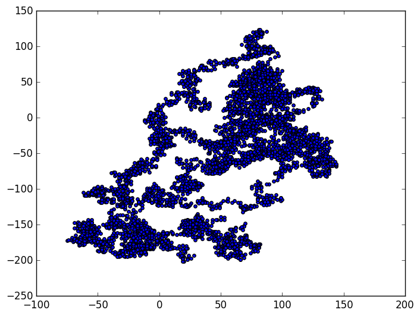

# Random Walk Generator



## Overview

The Random Walk Generator is a Python project that generates and visualizes random walks using the `matplotlib` library. This project is designed to demonstrate the creation of random walks and their graphical representation.

## Files

1. **randomwalks.py**: This module contains the `RandomWalks` class, offering functionality for generating random walks.

   - **Class Methods:**
     - `__init__(self, points=5000)`: Initializes attributes of a walk.
     - `fill_walk(self)`: Calculates all points in the walk.

2. **main.py**: The main script utilizes the `RandomWalks` class to create a random walk and plots the points using `matplotlib`. The resulting plot is saved as an image.

## Getting Started

1. **Clone the repository:**
   ```bash
   git clone https://github.com/Emzycodes/random-walk-generator.git

2. **Navigate to the project directory**
   ``` bash
   cd random-walk-generator

3. **Install Dependecies**
   ``` bash
   pip install -r requirements.txt

